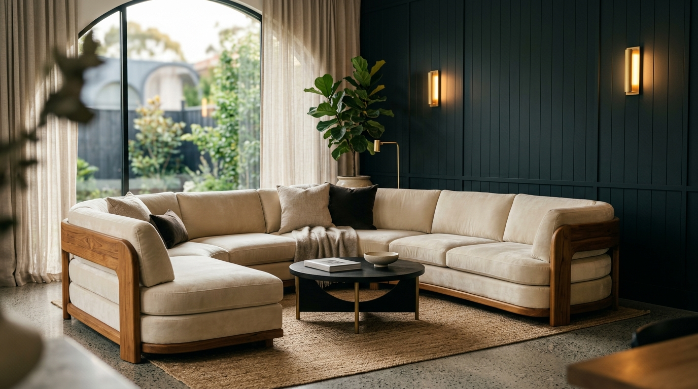

# Heaven Furniture Mart — Digital Flagship

> **"Designed. Crafted. Customized."**  
> Chattogram’s premier bespoke furniture and interior styling atelier.



---

## Brand Overview
- **Brand**: Heaven Furniture Mart
- **Category**: Luxury / Bespoke Furniture & Interior Styling
- **Location**: Agrabad Access Road (Opposite RAK Ceramics), Chattogram, Bangladesh
- **Founded**: 2020 by Managing Director **Abul Kalam Bhuiyan**
- **Contact**: +880 1960-481983 · `heavenfurnituremart@gmail.com`
- **Socials**: [Facebook](https://www.facebook.com/HeavenFurnitureMart) · [Instagram](https://www.instagram.com/heaven_furniture_ltd) · [YouTube](https://www.youtube.com/@HeavenFurnitureMart)

---

## Core Features
1. **The 30-Second Clarity Standard**:
   - Pinned luxury hero with instant brand clarity, flagship status pill, and direct CTAs.
2. **Split-Stage Manifesto & Craftsmanship**:
   - Sticky MD quote on the left + scrolling 4-stage timber craft masterclass on the right.
3. **Interactive Bespoke Studio (Signature Move)**:
   - Real-time room selector, timber swatches (Burma Teak, Mahogany, Gamari, Oak), fabric selector, and dimensional sliders.
   - 1-click **"Send This Spec to WhatsApp"** generating pre-formatted WhatsApp briefs to `+880 1960-481983`.
4. **Curated Collections Gallery**:
   - Filterable showcase of Living Room, Master Bedroom, Royal Dining, and Executive & Study suites.
5. **Flagship Atelier & Milestones**:
   - 2020–2026 milestone journey, Chamber of Commerce membership, BFIOA recognition, and Google Maps showroom pin.
6. **Mobile Concierge**:
   - Fixed bottom action bar with 1-tap WhatsApp, Direct Call, and Visit Booking.

---

## Tech Stack
- **Framework**: React 19 + Vite 8
- **Styling**: Tailwind CSS 4 with custom luxury design tokens
- **Kinematics & Smooth Scroll**: Lenis (120 FPS inertial scrolling)
- **Animation**: Framer Motion
- **Icons**: Lucide React + custom luxury SVGs
- **Testing**: Vitest + @testing-library/react + happy-dom

---

## Getting Started

```bash
# Install dependencies
npm install

# Run unit & integration test suite (27 tests)
npm test

# Start local development server
npm run dev

# Build for production
npm run build
```

---

## License
Private & Proprietary — Heaven Furniture Mart.
